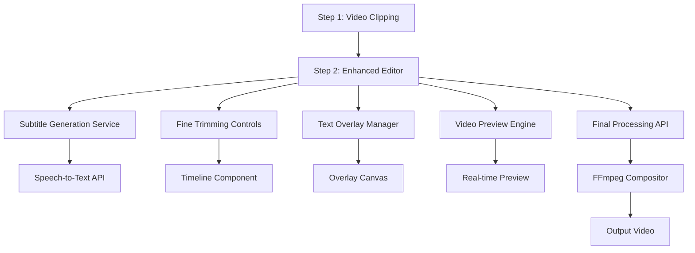

# Design Document

## Overview

The Video Editor Enhancements feature transforms the existing Step 2 placeholder into a comprehensive video editing interface. The design leverages the existing FFmpeg infrastructure while adding new capabilities for subtitle generation, fine-tuned trimming, and text overlays. The architecture maintains the current client-server pattern with enhanced API endpoints and a rich React-based editing interface.

## Architecture

### High-Level Architecture



### Component Architecture

The enhanced Step 2 will be restructured into modular components:

- **VideoEditorContainer**: Main container managing state and coordination
- **VideoPreview**: Enhanced video player with overlay rendering
- **SubtitleEditor**: Subtitle generation, editing, and timing controls
- **TrimmingControls**: Timeline-based fine trimming interface
- **TextOverlayManager**: Text overlay creation and positioning
- **ProcessingManager**: Final video processing and export

## Components and Interfaces

### 1. Enhanced SubtitleStep Component

**Purpose**: Replace the current placeholder with a full-featured video editor

**Key Props**:

```typescript
interface SubtitleStepProps {
  onBack: () => void;
  clippedVideoUrl: string;
  originalVideoMetadata: VideoMetadata;
}

interface VideoMetadata {
  duration: number;
  width: number;
  height: number;
  format: string;
}
```

**State Management**:

```typescript
interface EditorState {
  subtitles: SubtitleTrack[];
  trimBounds: { start: number; end: number };
  textOverlays: TextOverlay[];
  isProcessing: boolean;
  previewTime: number;
}
```

### 2. Subtitle Generation Service

**API Endpoint**: `/api/generate-subtitles`

**Implementation Approach**:

- Use local OpenAI Whisper installation for server-side transcription (primary)
- FFmpeg audio extraction and preprocessing for Whisper input
- Web Speech API as fallback option for basic transcription
- Python subprocess integration for Whisper execution

**Interface**:

```typescript
interface SubtitleTrack {
  id: string;
  segments: SubtitleSegment[];
}

interface SubtitleSegment {
  start: number;
  end: number;
  text: string;
  confidence?: number;
}
```

### 3. Timeline Component

**Purpose**: Provide visual timeline with draggable trim markers

**Features**:

- Waveform visualization using Web Audio API
- Draggable start/end markers
- Subtitle timing visualization
- Text overlay timing tracks

**Interface**:

```typescript
interface TimelineProps {
  duration: number;
  trimBounds: { start: number; end: number };
  onTrimChange: (bounds: { start: number; end: number }) => void;
  subtitles: SubtitleTrack[];
  textOverlays: TextOverlay[];
}
```

### 4. Text Overlay System

**Canvas-based Overlay Rendering**:

- HTML5 Canvas for real-time overlay preview
- Drag-and-drop positioning
- Font customization and styling

**Interface**:

```typescript
interface TextOverlay {
  id: string;
  text: string;
  position: { x: number; y: number };
  style: TextStyle;
  timing: { start: number; end: number };
}

interface TextStyle {
  fontSize: number;
  fontFamily: string;
  color: string;
  backgroundColor?: string;
  borderColor?: string;
}
```

## Data Models

### Video Processing Pipeline

```typescript
interface ProcessingRequest {
  videoUrl: string;
  trimBounds: { start: number; end: number };
  subtitles?: SubtitleTrack[];
  textOverlays?: TextOverlay[];
  outputFormat: "mp4" | "webm";
}

interface ProcessingResponse {
  processedVideoUrl: string;
  processingTime: number;
  fileSize: number;
}
```

### Client State Management

Using React's built-in state management with custom hooks:

```typescript
// Custom hooks for state management
const useVideoEditor = () => {
  const [editorState, setEditorState] = useState<EditorState>();
  // State management logic
};

const useSubtitleGeneration = () => {
  // Subtitle-specific state and operations
};

const useTextOverlays = () => {
  // Text overlay management
};
```

## Error Handling

### Client-Side Error Handling

1. **Network Errors**: Retry mechanisms with exponential backoff
2. **Processing Errors**: Clear error messages with recovery suggestions
3. **Validation Errors**: Real-time validation with inline feedback
4. **Browser Compatibility**: Graceful degradation for unsupported features

### Server-Side Error Handling

1. **FFmpeg Errors**: Detailed logging and user-friendly error translation
2. **File System Errors**: Proper cleanup and error recovery
3. **API Rate Limiting**: Queue management for subtitle generation
4. **Memory Management**: Streaming for large video files

### Error Recovery Strategies

```typescript
interface ErrorState {
  type: "network" | "processing" | "validation" | "system";
  message: string;
  recoverable: boolean;
  retryAction?: () => void;
}
```

## Testing Strategy

### Unit Testing

1. **Component Testing**: React Testing Library for UI components
2. **API Testing**: Jest for API endpoint testing
3. **Utility Testing**: Pure function testing for video processing utilities
4. **State Management**: Custom hook testing

### Integration Testing

1. **End-to-End Workflows**: Cypress for complete user journeys
2. **API Integration**: Testing video processing pipelines
3. **File Upload/Download**: Testing file handling workflows
4. **Cross-browser Testing**: Ensuring compatibility across browsers

### Performance Testing

1. **Video Processing Performance**: Benchmarking FFmpeg operations
2. **Memory Usage**: Monitoring memory consumption during processing
3. **UI Responsiveness**: Testing timeline scrubbing and preview performance
4. **Large File Handling**: Testing with various video sizes and formats

### Test Data Management

```typescript
// Mock data for testing
const mockVideoMetadata: VideoMetadata = {
  duration: 120,
  width: 1920,
  height: 1080,
  format: "mp4",
};

const mockSubtitleTrack: SubtitleTrack = {
  id: "test-track",
  segments: [{ start: 0, end: 5, text: "Hello world", confidence: 0.95 }],
};
```

## Implementation Considerations

### Performance Optimizations

1. **Video Preview**: Use video thumbnails for timeline scrubbing
2. **Real-time Updates**: Debounced updates for trim controls
3. **Memory Management**: Cleanup video URLs and canvas contexts
4. **Lazy Loading**: Load subtitle generation only when needed

### Browser Compatibility

1. **Web Audio API**: Fallback for waveform visualization
2. **Canvas Support**: Graceful degradation for text overlays
3. **File API**: Progressive enhancement for drag-and-drop
4. **Video Formats**: Multiple format support with fallbacks

### Security Considerations

1. **File Upload Validation**: Strict video format validation
2. **Processing Limits**: File size and duration limits
3. **Temporary File Cleanup**: Automatic cleanup of processed files
4. **Local Processing Security**: Secure subprocess execution for Whisper
5. **Python Environment**: Isolated Python environment for Whisper execution

### Scalability Considerations

1. **Processing Queue**: Background job processing for large files
2. **Caching Strategy**: Cache processed segments for re-editing
3. **CDN Integration**: Serve processed videos from CDN
4. **Database Storage**: Optional persistence for user projects

## Local Whisper Integration

### Setup Requirements

1. **Python Environment**: Python 3.8+ with pip
2. **Whisper Installation**: `pip install openai-whisper`
3. **Model Download**: Automatic download of Whisper models on first use
4. **FFmpeg Integration**: Audio extraction pipeline for Whisper input

### Whisper Processing Pipeline


### Implementation Details

**Audio Extraction**:

```bash
ffmpeg -i input.mp4 -vn -acodec pcm_s16le -ar 16000 -ac 1 output.wav
```

**Whisper Execution**:

```bash
whisper output.wav --model base --output_format json --language auto
```

**Node.js Integration**:

```typescript
import { spawn } from "child_process";

async function generateSubtitles(audioPath: string): Promise<SubtitleTrack> {
  return new Promise((resolve, reject) => {
    const whisper = spawn("whisper", [
      audioPath,
      "--model",
      "base",
      "--output_format",
      "json",
      "--language",
      "auto",
    ]);

    // Handle process completion and parse JSON output
  });
}
```
